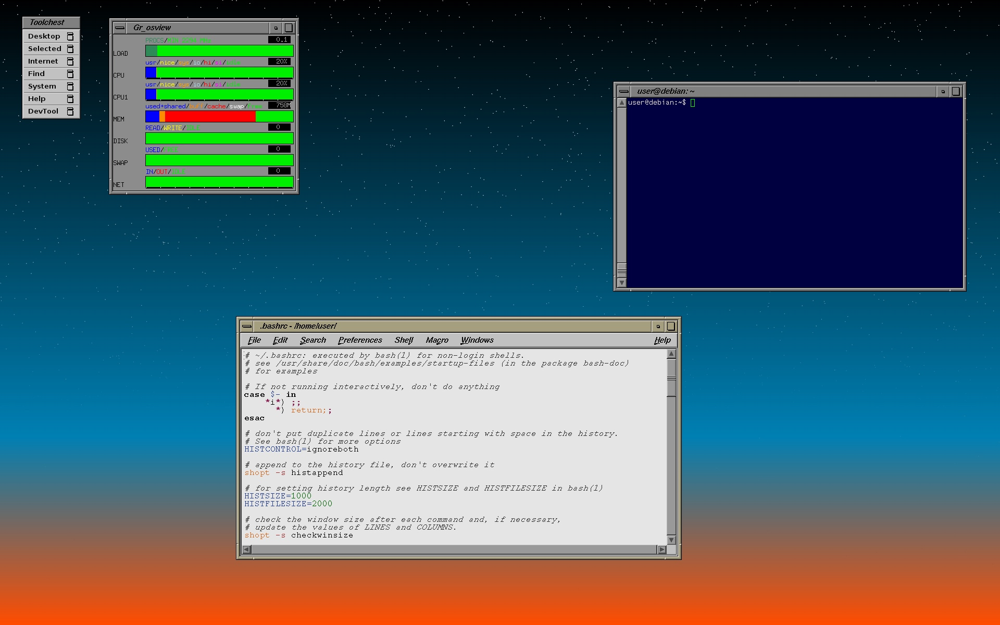
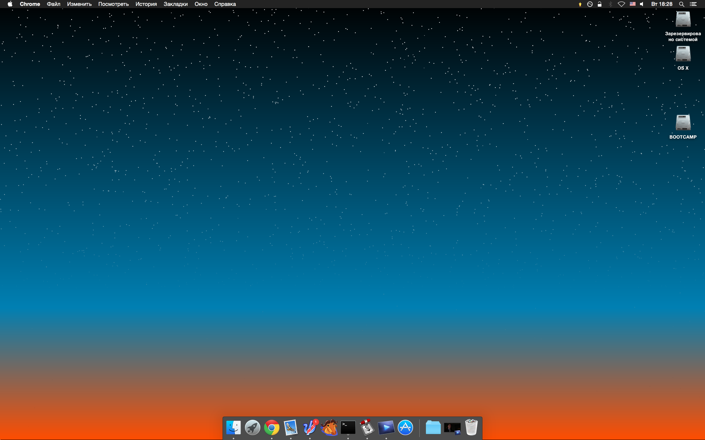

twilight
========

redo of IRIX twilight backdrop in old school OpenGL

TODO : 

>backdrop mode 
 (First have to see if it is even possible in GLUT, if not I will have to reimplement in glx)

>morph mode
 (evolve gradient color scheme over time)

